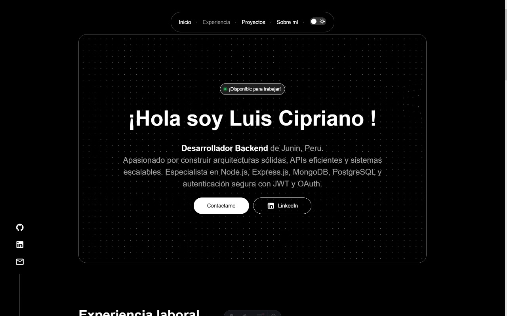

# 🦄 Unicorn Sparkle

**Unicorn Sparkle** es la plantilla de portafolio definitiva para desarrolladores que quieren brillar. Combina diseño moderno y funcionalidad mágica para mostrar tus proyectos y habilidades. ¡Destaca con estilo y haz que tu portafolio sea inolvidable!

[](https://www.figma.com/design/RPSa9nHARMmnTemhrGuTCZ/Portafolio-dev?node-id=44-1034&t=dIZVva7mcSSduV6j-1)
[](https://unicorn-sparkle.web.app)

# 🧠 Presentacion
¡Hola! 👋 Soy Luis Cipriano, un desarrollador backend apasionado por crear sistemas robustos, eficientes y seguros. Este repositorio contiene el código fuente de mi portafolio profesional, donde presento mis proyectos destacados, experiencia laboral y habilidades técnicas.

# 👨‍💻 ¿Qué encontrarás aquí?
- 🧱 Experiencia laboral
- 📊 Proyectos reales con tecnologías modernas
- ✨ Contribuciones y trabajos colaborativos
- ⚙️ Habilidades técnicas y herramientas dominadas

## Instalación y desarrollo local

```
1. Clonar el repositorio
git clone https://github.com/Dyogho/Portafolio.git
```
```
2. Instalar dependencias
npm install
```
```
3. Ejecutar en modo desarrollo
npm run dev
```

## Vista previa
